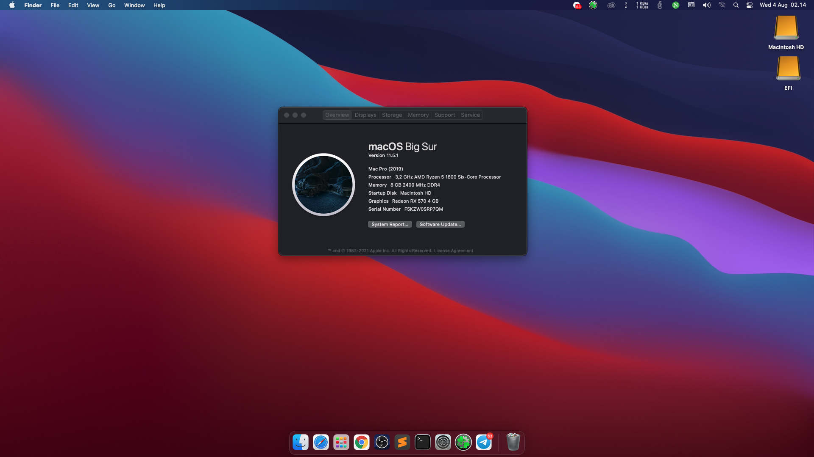

  

# Ryzentosh
##### Download EFI: [Releases](https://github.com/GebangKiidiw/EFI-Ryzentosh/releases)

Hackintosh EFI for AMD Ryzen 5 1600; RX570.

## Hardware

| Type                 | Name                              |
|----------------------|-----------------------------------|
| CPU                  | AMD Ryzen 5 1600 six Core         |
| MB                   | Gigabyte A320m-s2h                |
| Audio                | Realtek® Audio CODEC              |
| GPU                  | ASRocks Radeon RX570 4GB          |
| RAM                  | 8G DDR4 (4G * 2)                  |
| Ethernet             | RealtekRTL8111                    |
| Wi-Fi Bluetooth      | BCM94360CS2                       |
| NVME                 | ADATA XPG SX8200 PRO 256GB        |

## Patches & Kexts
 - [[Patch] AMD_Vanilla](https://github.com/AMD-OSX/AMD_Vanilla)
 - [[Kext] VirtualSMC](https://github.com/acidanthera/VirtualSMC)
 - [[Kext] Lilu](https://github.com/acidanthera/Lilu)
 - [[Kext] WhateverGreen](https://github.com/acidanthera/WhateverGreen)
 - [[Kext] VoodooHDA](https://sourceforge.net/projects/voodoohda/)
 - [[Kext] RealtekRTL8111](https://github.com/Mieze/RTL8111_driver_for_OS_X/releases)
 - [[Kext] RestrictEvents](https://github.com/acidanthera/RestrictEvents)

## Functional

- [x] CPU by [AMD-Vanilla](https://github.com/AMD-OSX/AMD_Vanilla)
- [x] Audio by [VoodooHDA](https://sourceforge.net/projects/voodoohda/) (alcid=2)
- [x] Graphics by [WhateverGreen](https://github.com/acidanthera/WhateverGreen)
- [x] USB
- [x] iMessage / FaceTime / iCloud
- [x] FileVault
- [x] Wi-Fi Bluetooth
- [x] Sleep
- [x] Supplementary updates (update your OpenCore EFI, kexts and patches first!)
 
## Resources
- https://vanilla.amd-osx.com/
- https://forum.amd-osx.com/
- https://github.com/AMD-OSX/AMD_Vanilla
- https://dortania.github.io/OpenCore-Desktop-Guide

## Screenshot

